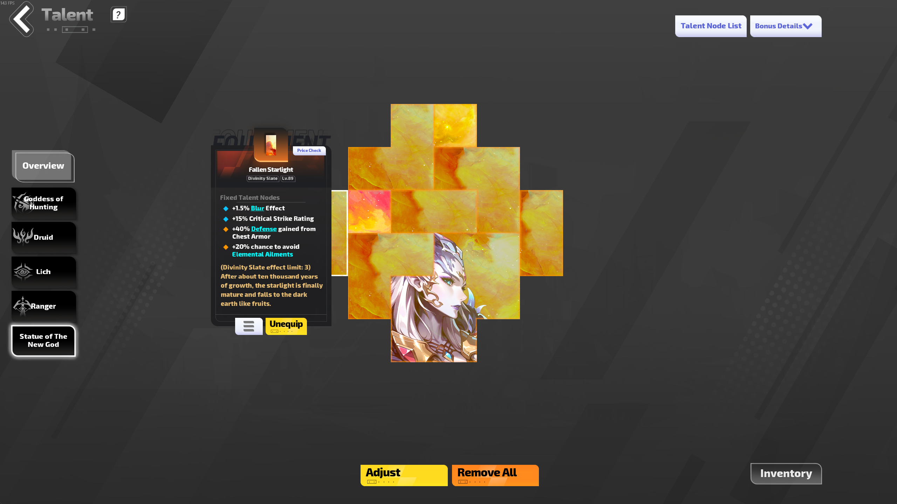

# Import Divinity Slates Guide

Import your in-game divinity slates into the build planner using AI-assisted screenshot parsing.

## Steps

### 1. Take in-game screenshots

Open your divinity page in Torchlight Infinite and click on each divinity slate to show its tooltip. Take a screenshot of each slate you want to import.



### 2. Upload screenshots to an AI chatbot

Upload your screenshots to [Claude](https://claude.ai) or [ChatGPT](https://chatgpt.com) with the following prompt:

````text
I've attached in-game screenshots of items from the game Torchlight Infinite.
I'd like you to parse the affix text for the focused item, which can be found in the rectangular gray tooltip in the middle-left or middle-right of the screen.
I'd like the following information from each item:
* Name, which can be found right below the gear tooltip picture, and above the text that says "Divinity Slate"
* Affixes, which are white or blue text with colored bullet points to their left. Only parse the left-aligned text with bullet points
  * retrieve affixes under both the "Fixed Talent Nodes" and "Brand Talent Nodes" headers
  * affixes may also contain newlines
Use the following json structure: `{name: string, affixes: string[]}`
For example:

```
{
  "name": "A Corner of Divinity",
  "affixes": [
    "+10 Strength",
    "+30% Skill Area\n+30% Minion Skill Area"
  ]
}
```
````

### 3. Import into the build planner

1. Go to the **Divinity** tab
2. Click the **Import Slates** button
3. Paste the JSON output from the AI chatbot
4. Click **Import**

The slates will be added to your inventory and can be placed on the divinity grid from there.

God slates default to "O" shape. You can change the shape after import using the slate editor.
